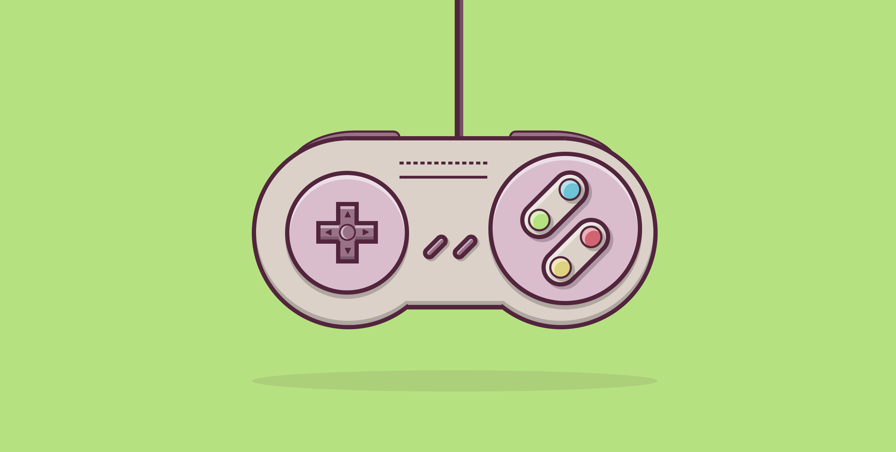

# CSS3 - Joystick SNES

Um projeto que desenvolvi para passar o tempo e me divertir.

## Preview

## Começando

Utilizei apenas HTML (básico), e CSS3, não é necessário nenhum pré-requisito para rodar a aplicação apenas um navegador :)

### Deploy

Não há rotina de deploy, utilizo a ferramenta [netlify]("https://www.netlify.com/")

## Autor

- **Alex Madeira** - [Bitbucket](https://bitbucket.org/alexmadeira5/)

## Licença

Copyright by [Alex Madeira](https://www.alexmadeira.com.br/).

Sinta-se a vontade para olhar, baixar, copiar, não tem problema :)

MIT license.
